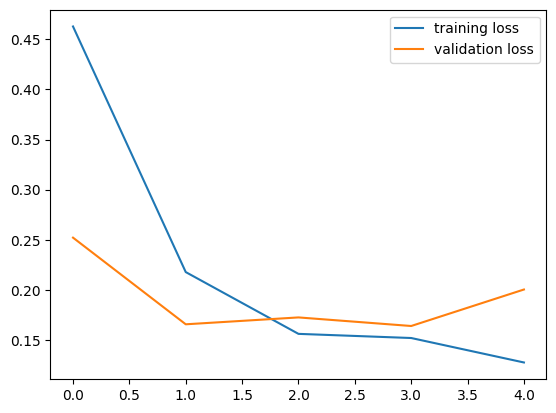

# Image Segmentation and Classification of SAR Water Images

## Introduction
This project focuses on leveraging deep learning models for the classification and segmentation of Synthetic Aperture Radar (SAR) water images. The primary objectives are:

1. **Image Classification**: Determine whether an image contains water using ConvNeXt, Vision Transformer (ViT), and ResNet models.
2. **Image Segmentation**: Segment regions containing water using U-Net, U-Net++, and Vision Transformer (ViT) architectures.

## Data Used
- **Dataset Source**: EUROSAT and kaggle(https://www.kaggle.com/datasets/franciscoescobar/satellite-images-of-water-bodies)
- **Data Description**:
  - SAR images with varying resolutions.
  - Labels for classification: `water` and `non-water`.
  - Masks for segmentation: true binary masks indicating water regions.
- **Preprocessing**:
  - Normalization and augmentation techniques applied to improve model performance.
  - Data split: [80% training and 20% testing].

## Classification Models and Performance
### Models Used
- **ConvNeXt**
- **Vision Transformer (ViT)**
- **ResNet**

### Performance analysis(Loss and Accuracy Curves):
**ConvNeXt (Small)**:

  

**ConvNeXt (Tiny)**:

  

**ViT**:

  

**ResNet**:

  

## Segmentation Models and Performance
### Models Used
- **U-Net**: A widely used architecture for biomedical image segmentation.
- **U-Net++**: An advanced version of U-Net with nested and dense skip connections.
- **ViT**: Adapted for image segmentation.

### Visualization of Results
Below are examples of true masks and predicted masks:

**UNET results:**
  

**Unet++ results:**
  

**ViT results:**
 

## Future work
- Exploring additional datasets for generalization.
- Implementing other advanced architectures.
- Fine-tuning hyperparameters for improved performance.

